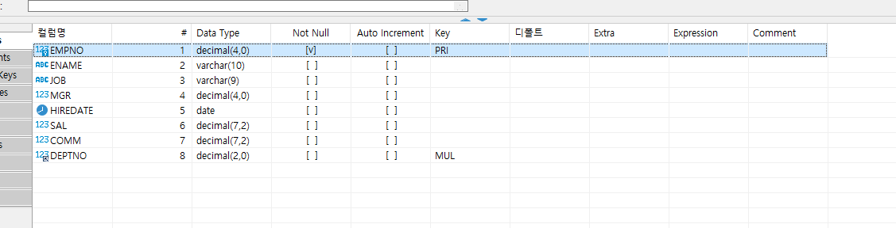

# 10월 13일 수업


- ### JAVASCRIPT
    - setAttribute - id, class, style 등 다양한 속성을 추가할 수 있다.
    - focus 와 blur - focus 이벤트는 요소가 포커스를 받을 때, blur 이벤트는 포커스를 잃을 때 발생한다.

    ```JavaScript
    window.onload = function(){
      var info = document.querySelectorAll(".movie");
      for(var i=0; i<info.length; i++){
        info[i].addEventListener("focus", function(){
          this.setAttribute('class','movie active');
        });
        info[i].addEventListener("blur",function(){
          this.setAttribute('class', 'movie');
        });
      }
    }
    ```
----
- ### 객체지향 언어
  - 객체 : 사물, 사람, 동물등 대표성을 지닌 독립적인 존재
    - 모든 객체는 자신만의 속성(특성)을 가지며, 자신만의 행동을 갖는다.
    - 객체는 자신만의 속성을 가진다 -> 변수
    - 객체는 자신만의 행동을 가진다 -> 함수
----
  - 객체 정의 : 추상화 시켜 놓은 것
    - 추상화 -> 불필요한 정보의 노출을 최소화하고 꼭 필요한 정보만 노출하는 기법
    - 차상화의 기본 : 속성과 행동을 나열하고 구성한다.
    - 멤버변수 : 객체의 속성을 구성
    - 멤버함수 : 객체의 속성을 기반으로 행동을 구현 해놓은 코드
----
  - 객체 생성 : new 연산을 통해서 생성
     - 생성된 객체는 변수에 저장하여 사용하는데 이떄 변수를 참조 변수라고 한다.
     - 참조변수는 ram의 주소를 저장하는 변수이다.    

    ```javascript
    var obj = new Object();
    ```

 - ### MySQL
    - 서브 쿼리
    1. 서브 : 보조 쿼리
    2. 괄호 안에 있는 쿼리가 서브 쿼리

    * ❗ 서브쿼리 실행 후 메인쿼리를 실행한다. ❗

    ----
  - 예시
    1. 스칼라 서브쿼리
    - SELECT 절에 오는 서브쿼리를 스칼라 서브쿼리라고 부른다.
    ```sql
    ELECT count(*) AS "모든 사원 수", (SELECT count(*) FROM emp WHERE job = "MANAGER") AS "사원 수" FROM emp

    SELECT count(*) AS "CLERK 사원 수", (SELECT count(*) FROM emp WHERE mgr IS NOT NULL) AS "사수가 있는 사원" FROM emp WHERE job = "CLERK"

    -- 스칼라 서브 쿼리
    ```
    2. 인라인 뷰
    - from 절에 오는 서브쿼리를 인라인 뷰(가상 테이블)라고 부른다. 
    - from 절에 오는 서브쿼리는 WHERE절 처럼 필터링할 때 사용한다.
    ```sql
    SELECT e.deptno
    FROM (SELECT deptno FROM emp GROUP BY deptno HAVING count(*)>4) AS sub
    INNER JOIN emp AS e ON sub.deptno = e.deptno
    -- 인라인 뷰
    ```
    3. 중첩쿼리
    - where 절에 오는 서브쿼리를 중첩 쿼리라고 부른다. 
    - 서브쿼리 중에 사용률이 매우 낮음
    - 중첩 쿼리는 단일 조회만 가능하다. 사용하려면 IN 을 사용 해야함
    ```sql
    -- 결과가 1개  
    SELECT * FROM emp WHERE empno = (SELECT empno FROM emp WHERE mgr IS null)
    -- 결과가 2개 이상
    SELECT * FROM emp WHERE empno in (SELECT empno FROM emp WHERE mgr IS null)
    ```

  - ### Primary key
          PRI는 Primary key의 줄임말로 PK라고 부른다.
          PK는 데이터가 중복해서 들어오는걸 막아준다.
          Primay key는 Default 값이 NOT NULL이다.
    